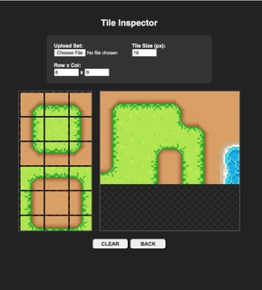

# Tileset Inspector Tool
[Click to Use The Tool](https://yuhanchao.github.io/tileset_inspector/)
This is an easy way to check how your tileset would look!

## 📌How to Use📌
1. **Upload your tileset**: Use the file picker to load your spritesheet.
2. **Set Tile Size**: Enter the pixel size of your single tile.
3. **Set Grid Dimensions**: Input the number of tiles in each row and column.
4. **Start Testing!**: Tiles will show up on the sidebar, click on the ones you want to test and they'll be displayed in your canvas!
5. **Refine Your Art?**:
   - Back: Use "BACK" to remove the last tile you placed. 
   - Clear: Use "CLEAR" to clean up and start over.

Hope this little tool would be useful to someone!🥰 You can have fun with the tileset I created, too.💫
